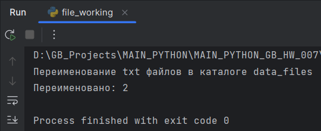
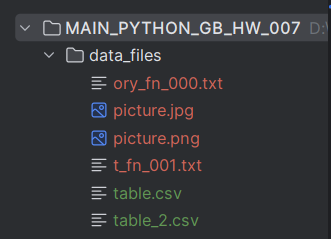

# Погружение в Python. Файлы и файловая система

## Задание 1

Напишите функцию группового переименования файлов. Она должна:
- Принимать параметр желаемое конечное имя файлов. При переименовании в конце имени добавляется порядковый номер.
- Принимать параметр количество цифр в порядковом номере.
- Принимать параметр расширение исходного файла. Переименование должно работать только для этих файлов внутри каталога.
- Принимать параметр расширение конечного файла.
- Принимать диапазон сохраняемого оригинального имени. Например, для диапазона ```[3, 6]``` берутся буквы с 3 по 6 из исходного имени файла. К ним прибавляется желаемое конечное имя, если оно передано. Далее счётчик файлов и расширение.

**Пример выполнения**

Каталог с файлами


Выполнение переименования



Каталог с переименованными файлами



## Задание 2

Соберите из созданных на уроке и в рамках домашнего задания функций пакет для работы с файлами.

Собран пакет files_pack  